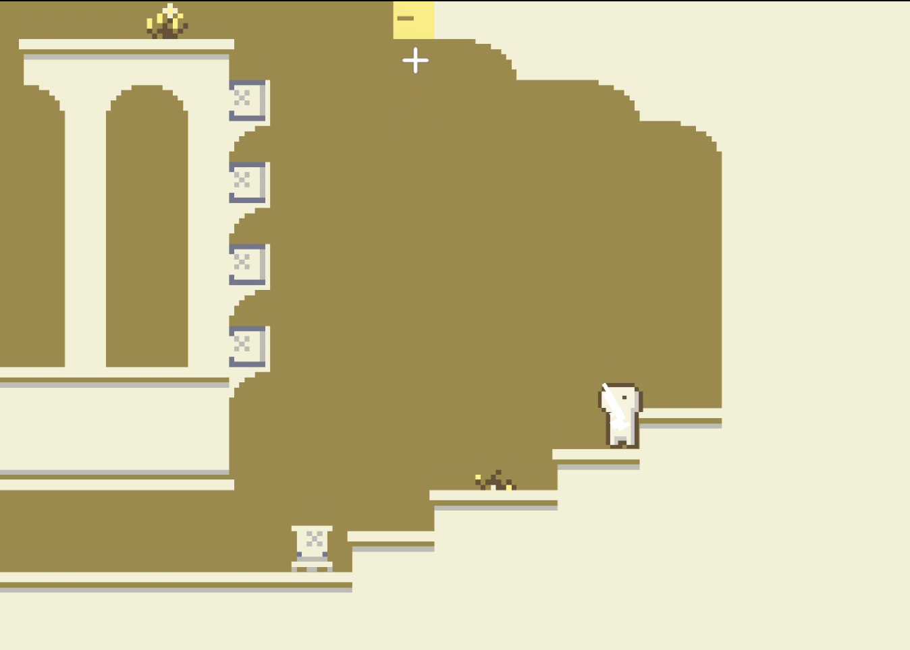
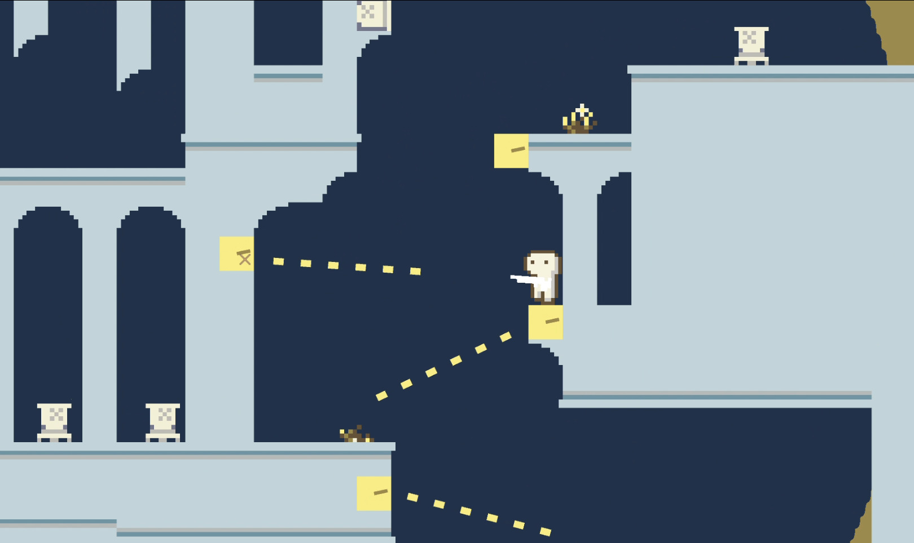
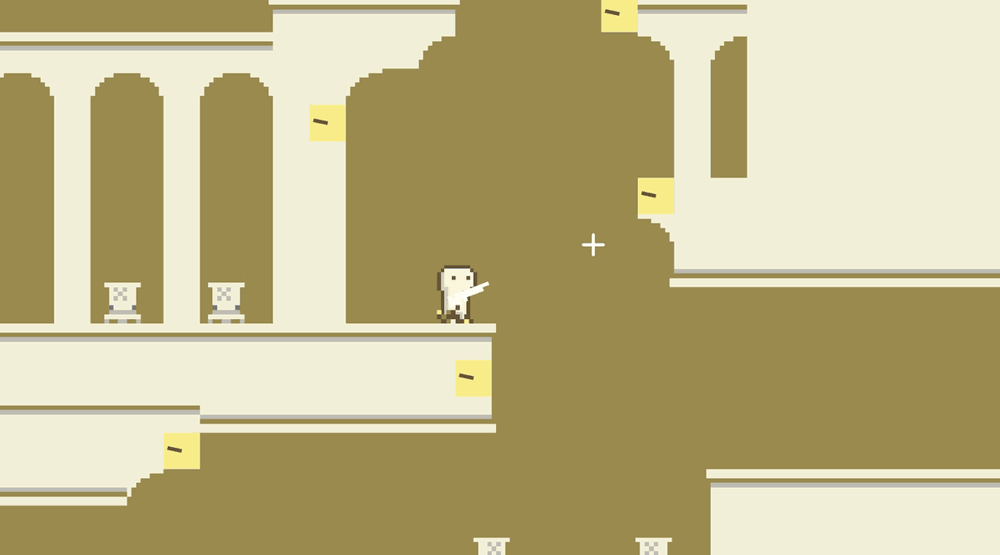

## 「Ruins of Time」 ーー 時の止まった世界で進もう

* 個人制作
* 開発環境：Unity・C#
* 制作時間：約1ヶ月

## プレイ動画
https://github.com/user-attachments/assets/379349db-005c-45d5-91ab-c48b14fe3fba

## 特徴
「時間停止」を中心とした様々なパズル・物語性のある演出

「時間停止」エフェクト

## 使用した素材

BGM・効果音：魔王魂

キャラクター動画参考：Arks
[https://arks.itch.io/dino-characters]  
背景参考：Adam Saltsman
[https://adamatomic.itch.io/amarelo]

KHドットフォント：Keitarou Hiraki, Font Silo  
Licensed under SIL Open Font License 1.1
